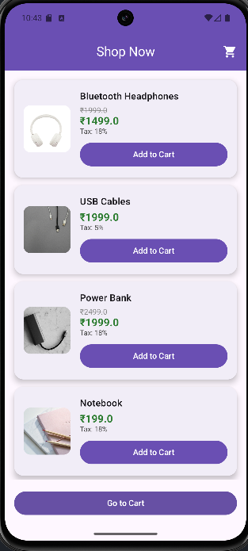
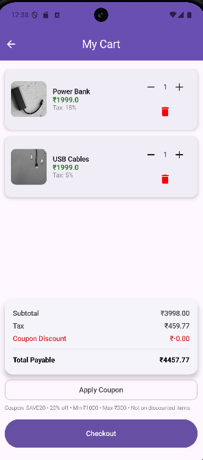
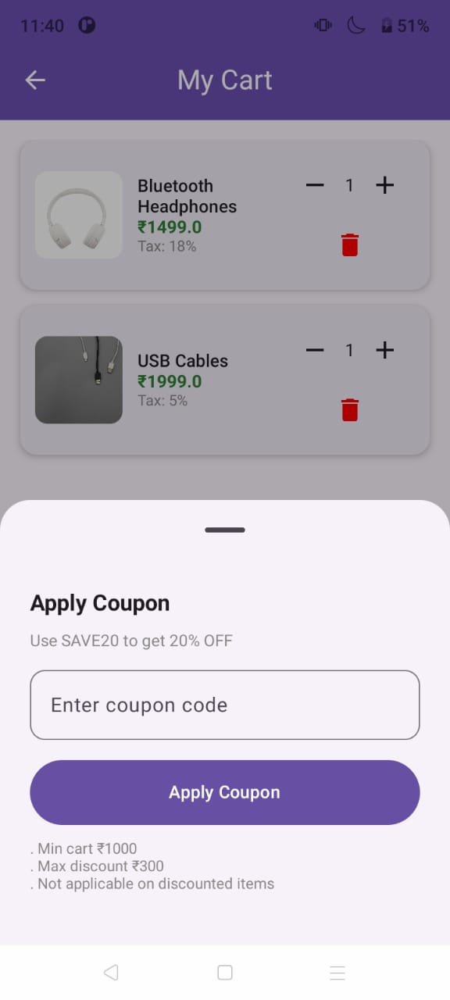
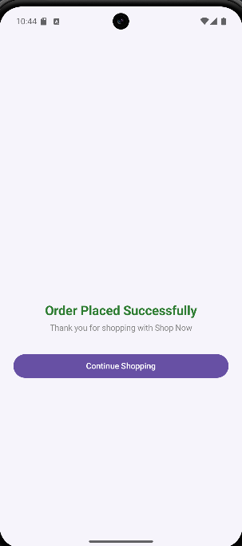

# 🛒 ShopNow – Mini Shopping Cart App

ShopNow is a modern Android shopping cart application built using **Jetpack Compose**.  
The app demonstrates product listing, cart management, coupon logic, tax calculation, and a smooth checkout experience with animations.

---

## 📌 Overview

- Built completely with **Jetpack Compose**
- Uses **in-memory data** (no backend)
- Clean **Material 3 UI**
- Smooth animations and modern UX
- Fully offline app

---

## ✨ Features

### 🛍️ Products
- Displays 5+ products stored in memory
- Products have:
    - Original price
    - Optional pre-discounted price
    - Mixed tax rates (5% & 18%)
- Product images included

### 🛒 Cart
- Add/remove items
- Increase/decrease quantity
- Real-time calculation of:
    - Subtotal
    - Tax
    - Discount
    - Total payable amount

### 🎟️ Coupon System
- Coupon Code: **SAVE20**
- Rules:
    - 20% discount
    - Minimum cart value: ₹1000
    - Maximum discount: ₹300
    - Coupon NOT applicable on discounted items
- Coupon applied via **popup (Modal Bottom Sheet)**

### 🎉 Checkout
- Checkout button enabled only when cart is not empty
- Confetti animation on successful checkout
- Order success screen with option to continue shopping

### 🚀 Splash Screen
- App logo displayed on splash screen
- Smooth scale animation
- Lottie loading animation
- Dark premium background

---

## 🧑‍💻 Tech Stack

- **Language:** Kotlin
- **UI Toolkit:** Jetpack Compose
- **Architecture:** MVVM
- **Design System:** Material 3
- **Animations:** Lottie
- **State Management:** ViewModel + StateFlow

---

## 📱 Screenshots

Screenshots are available in the `screenshots/` folder:

| Splash Screen | Product List | Cart |
|--------------|-------------|------|
|  |  |  |

| Coupon Popup | Checkout Success |
|-------------|------------------|
|  |  |

---

## 🎥 Demo Video

A working demo video is included showing:
- App launch
- Product selection
- Cart updates
- Coupon application
- Checkout flow

📎 **shopnow_demo.mp4**

---

## 📦 APK Download

A release APK is included for testing:

👉 **[Download ShopNow APK](https://github.com/apoorv077569/Shop-Now/releases/tag/v1.0)**

---

## 🧪 Coupon Logic Summary

| Rule | Value |
|----|------|
| Coupon Code | SAVE20 |
| Discount | 20% |
| Min Cart Value | ₹1000 |
| Max Discount | ₹300 |
| Applies On | Non-discounted items only |

---

## 🚀 How to Run the Project

1. Clone the repository
2. Open in **Android Studio**
3. Sync Gradle
4. Run on emulator or physical device

---

## 📌 Notes

- No backend or database is used
- App works completely offline
- Images are optimized to avoid memory crashes
- Launcher icon uses `mipmap`
- Splash/UI logo uses `drawable`

---

## 👨‍💻 Author

**Apoorv Rathore**  
Android Developer | Jetpack Compose
